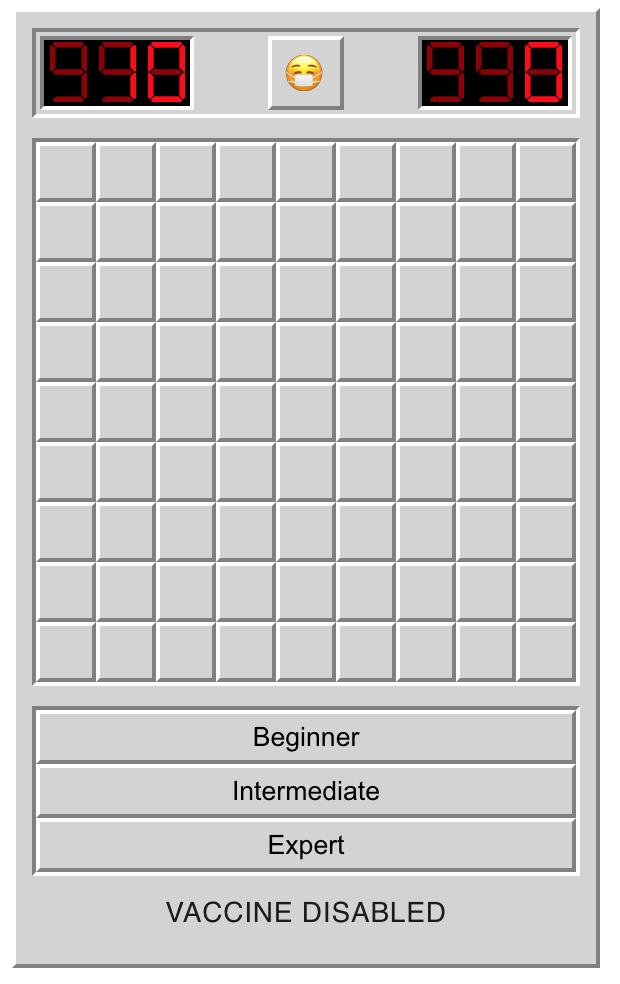

# Covidsweeper

An immitation of the popular Minesweeper just for practicing with React, Typescript and other related tools.
This project was bootstrapped with [Create React App](https://github.com/facebook/create-react-app).

## How to play

https://amegias.github.io/covidsweeper-react

The game will start after the first tap on any cell. The goal is to open all the cells which are not 🦠 and timer will measure how fast you are. If you tap on 🦠, the game will be over.

Switch the `vaccine` mode tapping on the `Vaccine enabled/disabled` button or pressing `F` key in order to enable/disable the way to mark the cells with 💉. It will be useful to know where the 🦠 is.
There are three levels available with different dimensions and number of 🦠.

## Available Scripts

In the project directory, you can run:

### `yarn`

Installs the project dependencies.

### `yarn start`

Runs the app in the development mode.\
Open [http://localhost:3000](http://localhost:3000) to view it in the browser.

The page will reload if you make edits.\
You will also see any lint errors in the console.

### `yarn test`

Launches the test runner in the interactive watch mode.\
See the section about [running tests](https://facebook.github.io/create-react-app/docs/running-tests) for more information.

### `yarn lint`

Analises the project in order to find issues in the code.

### `yarn prettier-check`

Checks the code style.

### `yarn prettier-write`

Checks the code style and tries to fix the issues found.

### `yarn build`

Builds the app for production to the `build` folder.\
It correctly bundles React in production mode and optimizes the build for the best performance.

The build is minified and the filenames include the hashes.\
Your app is ready to be deployed!

See the section about [deployment](https://facebook.github.io/create-react-app/docs/deployment) for more information.

## `yarn deploy`

Deploys a new build in GitHub Pages.

### `yarn eject`

**Note: this is a one-way operation. Once you `eject`, you can’t go back!**

If you aren’t satisfied with the build tool and configuration choices, you can `eject` at any time. This command will remove the single build dependency from your project.

Instead, it will copy all the configuration files and the transitive dependencies (webpack, Babel, ESLint, etc) right into your project so you have full control over them. All of the commands except `eject` will still work, but they will point to the copied scripts so you can tweak them. At this point you’re on your own.

You don’t have to ever use `eject`. The curated feature set is suitable for small and middle deployments, and you shouldn’t feel obligated to use this feature. However we understand that this tool wouldn’t be useful if you couldn’t customize it when you are ready for it.

## Learn More

You can learn more in the [Create React App documentation](https://facebook.github.io/create-react-app/docs/getting-started).

To learn React, check out the [React documentation](https://reactjs.org/).
